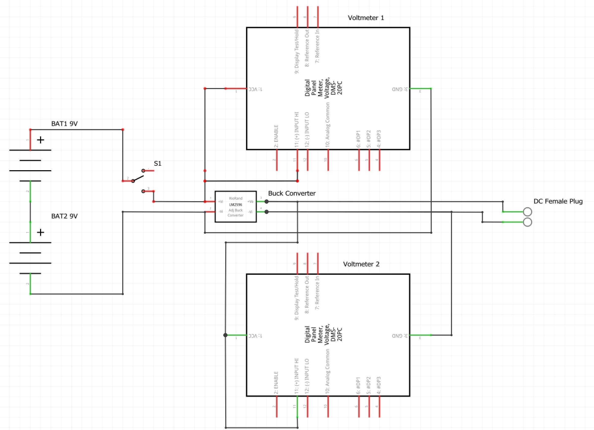

# Handheld-Powersupply

This device is an adjustable (0-18V) DC power supply.
It uses two 9V 800mAh block Batteries.
It can be adjusted with a small screwdriver.

This is the product from the front:

## The following components are used:
- All custom parts are printed with [CF-PLA](https://www.amazon.de/dp/B0CH36F58Y).
- 2 x [9V block Batteries](https://www.amazon.de/gp/product/B08BJYJYW3/ref=ppx_yo_dt_b_search_asin_title?ie=UTF8&psc=1).
- 2 x [Battery cable clip](https://www.amazon.de/Batterieclip-Anschluss-Anschlusskabel-Volt-Blocks-Schnappverbinder/dp/B0CHFG2V3R/ref=sr_1_6?__mk_de_DE=%C3%85M%C3%85%C5%BD%C3%95%C3%91&sr=8-6).
- 2 x [Digital Voltmeter](https://www.amazon.de/gp/product/B0BWLS9MVX/ref=ppx_yo_dt_b_search_asin_title?ie=UTF8).
- 1 x [DC-DC-Converter](https://www.amazon.de/dp/B0823P6PW6). 
- 1 x [Female DC plug](https://www.amazon.de/gp/product/B07QPZTHDK/ref=ppx_yo_dt_b_search_asin_title?ie=UTF8&psc=1).
- 1 x [Switch](https://www.amazon.de/gp/product/B07Z8VGQ5W/ref=ppx_yo_dt_b_search_asin_title?ie=UTF8&psc=1).
- 1 x [M2.5 x 6mm flat head screw](https://www.amazon.de/gp/product/B0876V2LGC/ref=ppx_yo_dt_b_search_asin_title?ie=UTF8&psc=1)(Battery cover).
- 1 x [Heat insert M2.5](https://www.amazon.de/gp/product/B07SYP6PRJ/ref=ppx_yo_dt_b_search_asin_title?ie=UTF8&psc=1).
- 1 x [M3 x 4mm flat head screw](https://www.amazon.de/gp/product/B09Y2SDQKS/ref=ppx_yo_dt_b_search_asin_title?ie=UTF8)(Main case connection).
- 1 x [Heat insert M3](https://www.amazon.de/Gewindeeinsatz-Einpressmutter-Gewindebuchsen-Kunststoff-Box-Kunststoffteiledurch/dp/B09B7F2XM3/ref=sr_1_5?__mk_de_DE=%C3%85M%C3%85%C5%BD%C3%95%C3%91&sr=8-5).

## Scematic
See also Frizzing [file](scematic.fzz):

Wired view of the product:

## Product demonstration
This is the CAD-view from the outside:

This is the CAD-view from the inside:

This is the product from the back:

This is the product from above:

